# Megapot Jackpot System - Auditor Introduction

## 1. Executive Summary

### System Purpose
The Megapot jackpot system is a decentralized jackpot protocol featuring cross-chain support, liquidity provider economics, and provably fair random number generation. The system enables users to purchase jackpot tickets as NFTs, participate in drawings with tiered prizes, and claim winnings across multiple blockchain networks.

### Critical Security Considerations
- **Entropy Security**: External dependency on Pyth Network for randomness generation
- **Economic Attacks**: LP pool manipulation, prize pool draining, fee extraction attacks
- **Cross-Chain Risks**: Bridge signature validation, fund custody, replay attack prevention
- **Accounting Errors**: Rounding errors, unaccounted for funds
- **Mathematical Correctness**: Combinatorial calculations, winner counting accuracy, bias prevention

### Audit Scope
Primary contracts: `Jackpot.sol`, `JackpotLPManager.sol`, `JackpotTicketNFT.sol`, `GuaranteedMinimumPayoutCalculator.sol`, `JackpotBridgeManager.sol`, `ScaledEntropyProvider.sol`
Critical libraries: `TicketComboTracker.sol`, `FisherYatesWithRejection.sol`

---
### Guiding Questions
1) Is there any way to drain funds in the jackpot via LP or referrer deposit/withdraw flows?
2) Is there any way to drain the jackpot by falsifying tickets?
3) Making sure the jackpot is truly fair and cannot be exploited (ie randomness is being correctly used and creating truly random outputs)
4) Is there any way that the jackpot could end up being -EV for LPs? Can we guarantee a minimum amount of edge?
5) Is there any way the jackpot could end up under-collateralized via accounting errors? Either business logic (ie. not accounting for all ticket winners) or rounding errors (especially accrued over time, rounding should be conservative with respect to collateralization)
6) Is there any way that LPs, referrers, or users could not be paid out what they're owed due to faulty state tracking or math? (ie not all ticket winners accounted for)
7) Is there any way to lock funds in the jackpot for any user - winners, referrers, LPs?
8) Is there any way that the jackpot could potentially get stuck and be unable to progress to the next drawing?
9) Can EIP-712 signatures be exploited as part of the bridging manager to either "steal" someones tickets or otherwise interfere with accounting? Either from signature replays or attempting hash collision.
10) is the case where the guaranteed payouts exceed the total value of the pool adequately handled?
11) Is all the bitpacking logic sound? Are there any potential boundary errors that could arise either between the lower bits where the normals are or the higher bits where bonusball must be less than 255 - normalBall Max?
12) Can admin changes (e.g., ticketPrice, normalBallMax, fees) made mid-drawing create inconsistent states or violate expectations for players/LPs?
---

## 2. System Architecture and Flows Overview

### Contract Hierarchy
```
Jackpot.sol (Main orchestrator)
├── JackpotLPManager.sol (LP economics)
├── JackpotTicketNFT.sol (ERC-721 tickets)
├── GuaranteedMinimumPayoutCalculator.sol (Payout calculations)
├── ScaledEntropyProvider.sol (Randomness)
└── JackpotBridgeManager.sol (Cross-chain operations)

Libraries:
├── TicketComboTracker.sol (Settlement calculations)
├── FisherYatesWithRejection.sol (Unbiased sampling)
└── Combinations.sol (Mathematical utilities)
```

### User Flows

#### buyTickets Function Flow

The `buyTickets` function orchestrates the complete ticket purchase process, involving multiple contract interactions, validations, token transfers, and state updates.

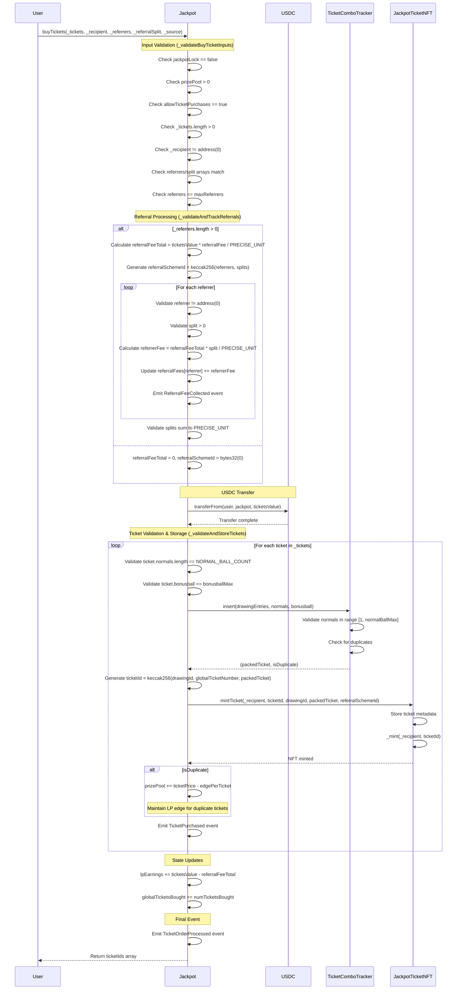

**Key Interactions:**

1. **Input Validation**: Comprehensive checks on drawing state, ticket purchase permissions, and input parameters
2. **Referral Processing**: Optional referral fee calculation and distribution to multiple referrers with custom splits
3. **USDC Transfer**: User pays full ticket cost upfront via `transferFrom`
4. **Ticket Processing**: Each ticket is validated, stored in combo tracker, and minted as NFT
5. **Duplicate Handling**: Duplicate tickets increase prize pool by `ticketPrice * (1 - lpEdgeTarget)` to maintain LP profitability
6. **State Updates**: LP earnings and global ticket counters are updated
7. **Event Emissions**: Multiple events track referral fees, individual tickets, and the complete order

**Security Features:**
- Reentrancy protection via `nonReentrant` modifier
- Emergency mode protection via `noEmergencyMode` modifier
- Comprehensive input validation at multiple levels
- Duplicate ticket detection prevents combo tracker corruption
- Referral fee validation ensures splits sum to 100%

#### claimWinnings Function Flow

The `claimWinnings` function allows ticket holders to claim winnings from completed drawings, involving ticket validation, tier calculation, referral distribution, and payout processing.

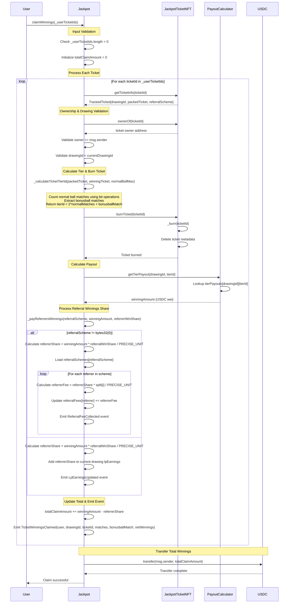

**Key Interactions:**

1. **Ticket Validation**: Each ticket is validated for ownership and drawing completion
2. **Tier Calculation**: Bit operations count normal ball matches, bonusball extracted separately
3. **Ticket Burning**: NFTs are burned to prevent double-claiming before payout calculation
4. **Payout Lookup**: PayoutCalculator provides tier-specific winning amounts for each drawing
5. **Referral Distribution**: Winners' referral share is distributed to referrers or returned to LP earnings
6. **Batch Processing**: All tickets processed in single transaction, total winnings transferred once

**Security Features:**
- Reentrancy protection via `nonReentrant` modifier
- Ownership verification for each ticket via ERC721 `ownerOf`
- Drawing completion validation prevents premature claims
- Ticket burning prevents double-claiming
- Automatic referral fee distribution maintains system accounting

**Economic Flow:**
- Winner receives `winningAmount - referrerShare` USDC
- Referrers receive their portion of `referrerShare` based on splits
- If no referral scheme, `referrerShare` goes to current drawing LP earnings
- All winnings come from completed drawing prize pools

#### emergencyRefundTickets Function Flow

The `emergencyRefundTickets` function provides a safety mechanism during emergency mode, allowing ticket holders to reclaim funds from tickets in the current (failed) drawing.

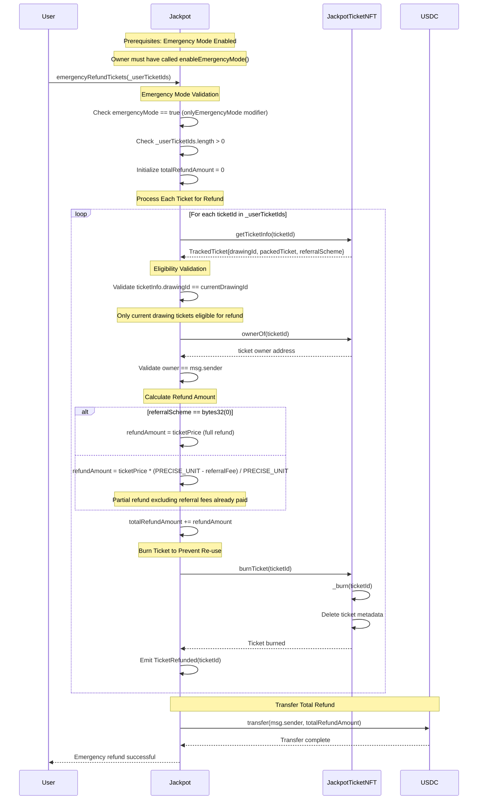

**Key Interactions:**

1. **Emergency Mode Gate**: Function only callable when emergency mode is active
2. **Current Drawing Only**: Only tickets from the current (failed) drawing are eligible
3. **Ownership Verification**: Each ticket ownership validated via ERC721 `ownerOf`
4. **Referral-Aware Refund**: Refund amount accounts for referral fees already distributed
5. **Ticket Burning**: NFTs destroyed to prevent reuse or double-refunding
6. **Batch Processing**: All eligible tickets processed in single transaction

**Security Features:**
- **Emergency Gate**: `onlyEmergencyMode` modifier restricts access to crisis situations
- **Reentrancy Protection**: `nonReentrant` modifier prevents reentrancy attacks
- **Drawing Restriction**: Only current drawing tickets eligible, prevents historical manipulation
- **Ownership Validation**: Per-ticket ownership verification prevents unauthorized refunds
- **Ticket Destruction**: NFT burning eliminates possibility of double-refunding

**Economic Considerations:**
- **Referral Fee Handling**: Users without referrers get full refund, others get `ticketPrice - referralFees`
- **Current Drawing Only**: Prevents abuse by limiting to failed/problematic drawings
- **No Winner Calculation**: Emergency refunds bypass normal drawing mechanics
- **LP Pool Impact**: Refunds come from contract USDC balance, potentially affecting LP pool

**Emergency Mode Context:**
- Activated by owner via `enableEmergencyMode()` during system failures
- Disables normal operations (`buyTickets`, LP operations) via `noEmergencyMode` modifier
- Provides escape hatch for users when drawings cannot complete normally
- Must be manually disabled by owner to resume normal operations

#### buyTickets via JackpotBridgeManager Function Flow

The `buyTickets` function in `JackpotBridgeManager` enables cross-chain ticket purchases by acting as a custodial intermediary, handling ticket ownership tracking for users on different chains.

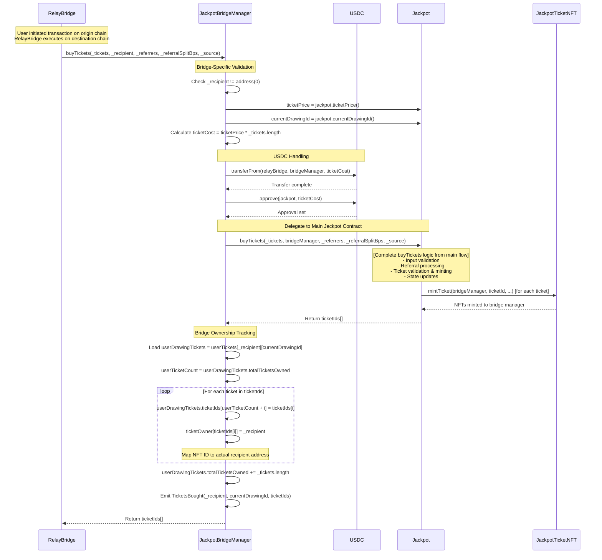

**Key Interactions:**

1. **Cross-Chain Execution**: RelayBridge executes transaction on destination chain
2. **Custodial Intermediary**: Bridge manager receives NFTs but tracks true ownership
3. **USDC Flow**: RelayBridge → Bridge Manager → Jackpot (with approval)
4. **Ownership Mapping**: Maps each NFT to the intended recipient address
5. **State Tracking**: Maintains per-user, per-drawing ticket inventories
6. **Event Transparency**: Emits bridge-specific events with recipient information

**Bridge-Specific Logic:**
- **NFT Custody**: Tickets minted to bridge manager address, not end user
- **Ownership Tracking**: `ticketOwner[ticketId] = _recipient` maps NFTs to true owners
- **User Inventory**: `userTickets[recipient][drawing]` tracks tickets per user per drawing
- **Cross-Chain Preparation**: Enables tickets to be claimed/transferred across chains

**Security Features:**
- **Reentrancy Protection**: `nonReentrant` modifier prevents reentrancy attacks
- **Recipient Validation**: Ensures valid recipient address for ownership tracking
- **Custodial Transparency**: Clear mapping between NFT custody and ownership
- **Event Auditing**: `TicketsBought` event includes actual recipient, not bridge address

**USDC Handling:**
- **Cross-Chain Transfer**: RelayBridge → Bridge Manager → Jackpot via approval pattern
- **Exact Amount**: No fees retained by bridge manager
- **Approval Management**: Bridge manager approves exact amount to Jackpot
- **Bridge Provision**: RelayBridge provides USDC from cross-chain bridge operations

**State Management:**
- **Per-User Tracking**: `userTickets[recipient][drawing].ticketIds[]` array
- **Total Counters**: `userTickets[recipient][drawing].totalTicketsOwned` 
- **NFT Mapping**: `ticketOwner[ticketId]` points to true owner
- **Drawing Scoped**: Separate tracking per drawing for each user

**Cross-Chain Integration:**
- **Custodial Model**: Bridge holds NFTs while preserving ownership records
- **Transfer Preparation**: Ownership tracking enables later NFT transfers
- **Claim Integration**: Maps to `claimWinnings()` and `claimTickets()` functions
- **Multi-Chain Users**: Single contract serves users across different chains

**Delegation Pattern:**
- **Core Logic Reuse**: Delegates main purchase logic to primary Jackpot contract
- **Specialized Wrapping**: Adds bridge-specific ownership tracking
- **Event Augmentation**: Emits additional events with bridge context
- **State Synchronization**: Maintains consistency with main contract state

#### claimWinnings via JackpotBridgeManager Function Flow

The `claimWinnings` function in `JackpotBridgeManager` enables cross-chain winnings claims through keeper-executed transactions authorized by user EIP-712 signatures.

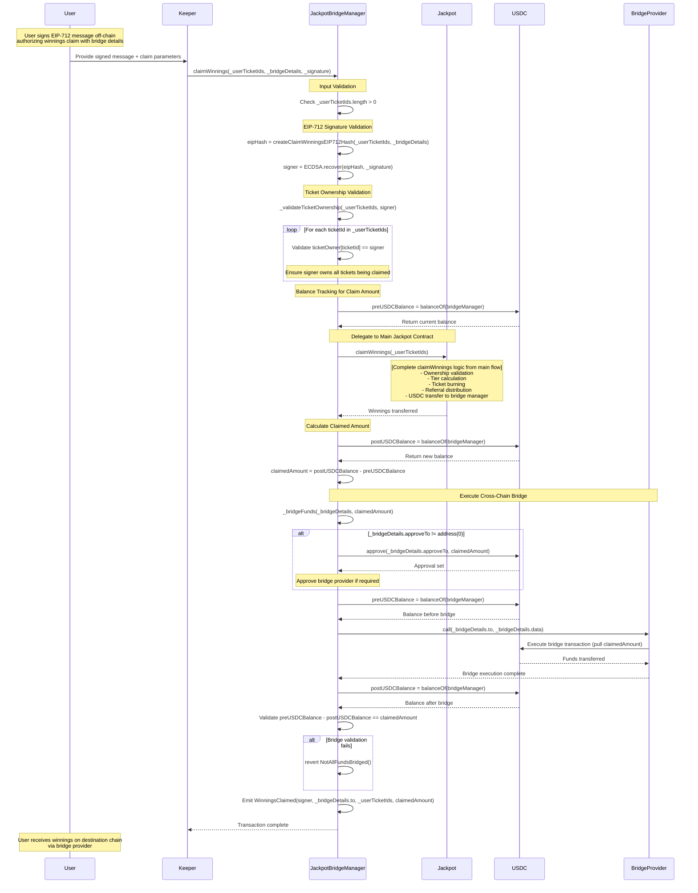

**Key Interactions:**

1. **EIP-712 Authorization**: User signs off-chain message authorizing keeper to claim on their behalf
2. **Keeper Execution**: Keeper submits transaction with user's signature and bridge details
3. **Signature Validation**: ECDSA recovery validates user authorization
4. **Ownership Verification**: Ensures signer owns all tickets being claimed
5. **Delegated Claiming**: Bridge manager claims from main Jackpot contract
6. **Amount Tracking**: Precise calculation of winnings received from claim
7. **Cross-Chain Bridge**: Automatic bridging of funds to user's destination chain
8. **Validation**: Ensures exact claimed amount was successfully bridged

**Authorization Model:**
- **EIP-712 Signatures**: Structured signatures prevent replay attacks and ensure intent clarity
- **Keeper Pattern**: Allows third-party execution while maintaining user authorization
- **Bridge Details**: Signature includes specific bridge transaction data for security
- **Ownership Mapping**: Bridge manager's `ticketOwner` mapping validates ticket ownership

**Bridge Execution:**
- **Amount Calculation**: Precise tracking of USDC balance before/after Jackpot claim
- **Conditional Approval**: Approves bridge provider only if required by bridge route
- **Generic Bridge Call**: Supports multiple bridge providers via generic call interface
- **Validation**: Ensures exact claimed amount was transferred by bridge provider

**Security Features:**
- **Reentrancy Protection**: `nonReentrant` modifier prevents reentrancy attacks
- **Signature Validation**: EIP-712 + ECDSA ensures authentic user authorization
- **Ownership Verification**: Per-ticket ownership validation prevents unauthorized claims
- **Amount Verification**: Ensures claimed amount matches bridged amount exactly
- **Bridge Validation**: Confirms all funds successfully transferred to bridge provider

**Cross-Chain Integration:**
- **Off-Chain Signing**: User signs authorization on any chain
- **Keeper Network**: Third-party keepers can execute on user's behalf
- **Bridge Flexibility**: Supports multiple bridge providers and routes
- **Destination Delivery**: Funds automatically delivered to user's destination chain

**State Management:**
- **No State Changes**: Bridge manager doesn't update ownership tracking (tickets burned in main contract)
- **Balance Tracking**: Temporary balance tracking for amount calculation
- **Event Emission**: Complete audit trail with signer, destination, and amounts

**Economic Flow:**
- **Jackpot → Bridge Manager**: Winnings transferred from main contract
- **Bridge Manager → Bridge Provider**: Funds transferred to bridge for cross-chain delivery
- **No Fees**: Bridge manager retains no fees (all handled by bridge provider)

#### claimTickets via JackpotBridgeManager Function Flow

The `claimTickets` function in `JackpotBridgeManager` enables users to transfer ticket ownership from bridge custody to direct ownership on the protocol's home chain through keeper-executed transactions authorized by user EIP-712 signatures.

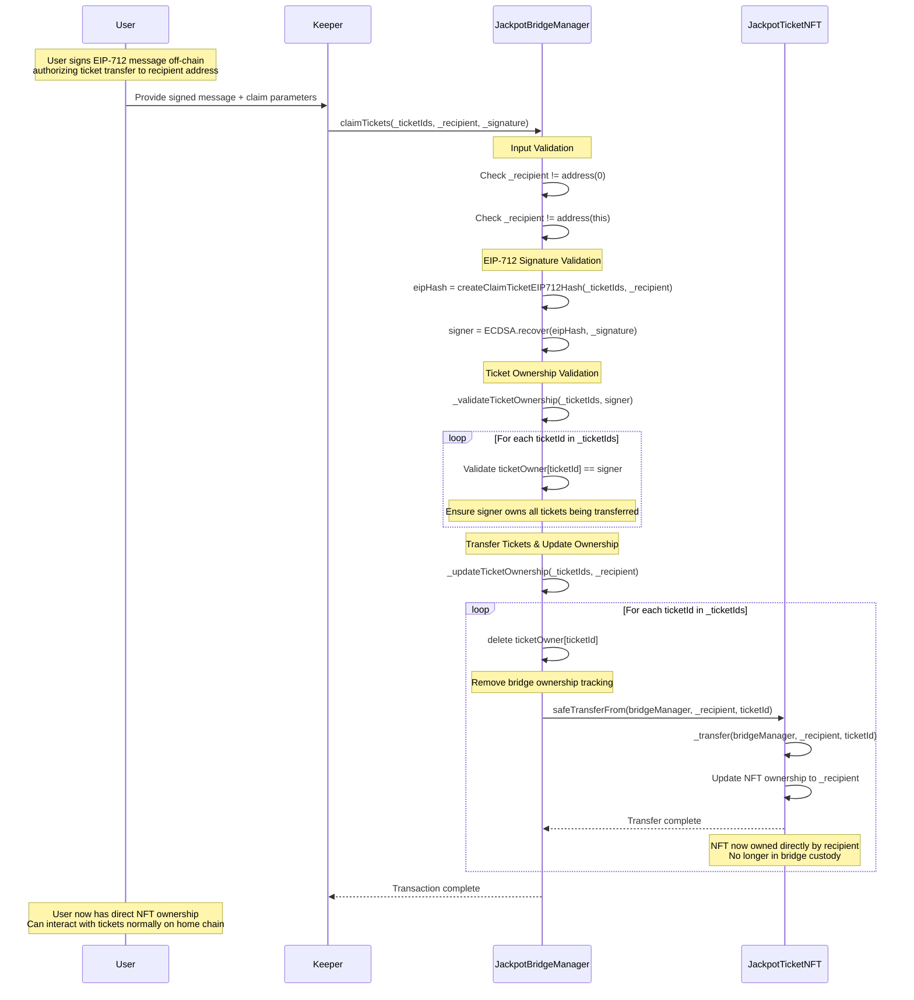

**Key Interactions:**

1. **EIP-712 Authorization**: User signs off-chain message authorizing keeper to transfer tickets
2. **Keeper Execution**: Keeper submits transaction with user's signature and recipient details
3. **Signature Validation**: ECDSA recovery validates user authorization
4. **Ownership Verification**: Ensures signer owns all tickets being transferred
5. **NFT Transfer**: Direct ERC-721 transfers from bridge manager to recipient
6. **State Cleanup**: Removes bridge ownership tracking for transferred tickets
7. **Home Chain Integration**: Recipients can now interact with tickets normally

**Authorization Model:**
- **EIP-712 Signatures**: Structured signatures include ticket IDs and recipient address
- **Keeper Pattern**: Allows third-party execution while maintaining user authorization
- **Recipient Specification**: User explicitly authorizes specific recipient address
- **Transfer Intent**: Signature clearly indicates intent to transfer ownership

**Ticket Transfer Process:**
- **Ownership Cleanup**: Bridge manager removes internal ownership tracking
- **NFT Transfer**: Standard ERC-721 `safeTransferFrom` to recipient
- **Direct Ownership**: Recipient gains full NFT ownership on home chain
- **No Bridging**: Pure ownership transfer without cross-chain operations

**Security Features:**
- **Reentrancy Protection**: `nonReentrant` modifier prevents reentrancy attacks
- **Signature Validation**: EIP-712 + ECDSA ensures authentic user authorization
- **Ownership Verification**: Per-ticket ownership validation prevents unauthorized transfers
- **Recipient Validation**: Ensures valid recipient address and prevents self-transfers
- **State Consistency**: Clean removal of bridge tracking maintains state integrity

**Home Chain Integration:**
- **Standard NFT Ownership**: Recipients hold tickets as normal ERC-721 tokens
- **Direct Interaction**: Users can claim winnings, transfer, or interact normally
- **No Bridge Dependency**: Tickets function independently after transfer
- **Full Control**: Recipients have complete ownership and control

**State Management:**
- **Bridge State Cleanup**: `ticketOwner[ticketId]` mapping entries deleted
- **NFT Ownership Transfer**: Standard ERC-721 ownership update
- **No Persistent Tracking**: Bridge manager no longer tracks transferred tickets
- **Clean Transition**: Seamless movement from bridge custody to direct ownership

**Use Cases:**
- **Home Chain Preference**: Users wanting direct ownership on protocol's native chain
- **Simplified Interaction**: Avoiding bridge complexity for claiming/transfers
- **Portfolio Consolidation**: Moving tickets to primary wallet address
- **Integration Needs**: Applications requiring direct NFT ownership

**Economic Considerations:**
- **No Fees**: Bridge manager charges no fees for ticket transfers
- **Gas Only**: Users pay only transaction gas costs
- **Value Preservation**: Tickets retain full value and functionality
- **No Slippage**: Direct transfer without price impact

**Comparison to claimWinnings:**
- **No Bridging**: Pure ownership transfer vs cross-chain value transfer
- **No USDC Flow**: NFT transfer only, no token movements
- **Simpler Flow**: Direct transfer without bridge provider integration
- **Home Chain Only**: Recipients must be on same chain as protocol

### LP Flows

#### lpDeposit Function Flow

The `lpDeposit` function allows liquidity providers to deposit USDC into the pool, with deposits processed at the end of the current drawing and shares calculated based on accumulator pricing.

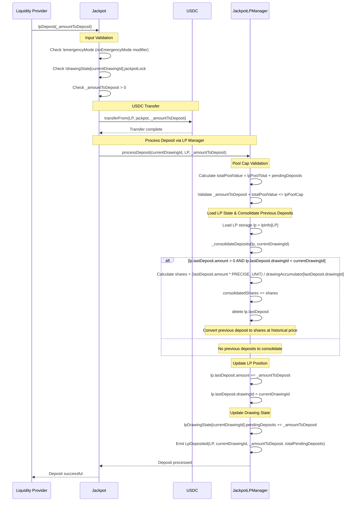

**Key Interactions:**

1. **State Validation**: Ensures drawing is unlocked and emergency mode is disabled
2. **USDC Transfer**: Immediate USDC transfer from LP to Jackpot contract
3. **Pool Cap Check**: Validates deposit won't exceed governance-set pool capacity
4. **Deposit Consolidation**: Converts any previous deposits from completed drawings to shares
5. **Position Update**: Updates LP's pending deposit for current drawing
6. **Drawing Tracking**: Updates total pending deposits for current drawing

**Timing & Lifecycle:**
- **Deposit Phase**: USDC deposited immediately during current drawing
- **Share Calculation**: Delayed until drawing settlement using end-of-drawing accumulator
- **Consolidation**: Previous deposits converted to shares when accessing LP functions
- **Pool Participation**: New deposits become active in next drawing's prize pool

**Economic Mechanics:**
- **Accumulator Pricing**: Share price = `USDC_amount * PRECISE_UNIT / accumulator_at_deposit_drawing`
- **Pool Cap Enforcement**: Prevents single drawing from exceeding governance limits
- **Pending State**: Deposits held as USDC until drawing settlement
- **Price Discovery**: Share price reflects historical pool performance via accumulator

**Security Features:**
- **Reentrancy Protection**: `nonReentrant` modifier on main function
- **Emergency Gate**: `noEmergencyMode` prevents deposits during crisis
- **Drawing Lock**: Prevents deposits while drawing is being executed
- **Pool Cap Validation**: Conservative check excludes pending withdrawals
- **Access Control**: LPManager functions restricted to Jackpot contract

**State Management:**
- **Individual LP**: `lastDeposit.amount` and `lastDeposit.drawingId` updated
- **Global Drawing**: `pendingDeposits` tracks total deposits for current drawing
- **Consolidation**: Automatic conversion of historical deposits to current shares
- **Share Accumulation**: `consolidatedShares` tracks LP's total share balance

#### initiateWithdraw Function Flow

The `initiateWithdraw` function allows LPs to begin the withdrawal process by converting consolidated shares to pending withdrawals, which can be finalized after the current drawing completes.

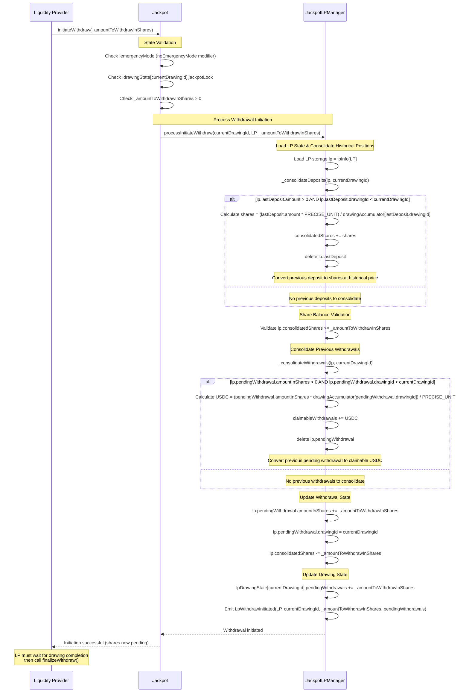

**Key Interactions:**

1. **State Validation**: Ensures drawing is unlocked and emergency mode is disabled
2. **Historical Consolidation**: Converts previous deposits and withdrawals to current state
3. **Share Balance Check**: Validates LP has sufficient consolidated shares to withdraw
4. **Share State Transfer**: Moves shares from consolidated to pending withdrawal status
5. **Drawing Tracking**: Updates total pending withdrawals for current drawing
6. **Two-Step Process**: Withdrawal cannot complete until drawing finishes

**Timing & Lifecycle:**
- **Initiation Phase**: Shares moved to pending status during current drawing
- **Waiting Period**: Shares remain pending until drawing settlement completes
- **Finalization Phase**: LP must call `finalizeWithdraw()` after drawing ends however funds are removed from lpPool at end of drawing
- **USDC Conversion**: Final USDC amount determined by end-of-drawing accumulator

**Economic Mechanics:**
- **Share Locking**: Pending shares cannot participate in drawing outcomes (after the drawing they were withdrawn is concluded)
- **Price Discovery**: Final USDC value determined at drawing settlement
- **Accumulator Impact**: Share-to-USDC conversion uses `accumulator[withdrawalDrawingId]`
- **Pool Exposure**: LPs exposed to current drawing risk until withdrawal finalizes

**Security Features:**
- **Emergency Gate**: `noEmergencyMode` prevents withdrawals during crisis
- **Drawing Lock**: Prevents withdrawals while drawing is being executed
- **Share Balance Validation**: Ensures LP has sufficient shares before proceeding
- **Access Control**: LPManager functions restricted to Jackpot contract

**State Management:**
- **Individual LP**: 
  - `consolidatedShares` decreased by withdrawal amount
  - `pendingWithdrawal.amountInShares` and `pendingWithdrawal.drawingId` updated
  - Previous positions consolidated automatically
- **Global Drawing**: `pendingWithdrawals` tracks total shares being withdrawn
- **Historical Cleanup**: Previous deposits/withdrawals converted to current state

**Risk Considerations:**
- **Drawing Exposure**: Shares remain exposed to current drawing outcome
- **Timing Risk**: Final USDC amount depends on drawing results
- **Liquidity Risk**: Cannot cancel once initiated until drawing completes
- **Settlement Dependency**: Requires drawing completion for finalization

#### finalizeWithdraw Function Flow

The `finalizeWithdraw` function completes the two-step withdrawal process by converting claimable withdrawals to USDC and transferring funds to the LP.

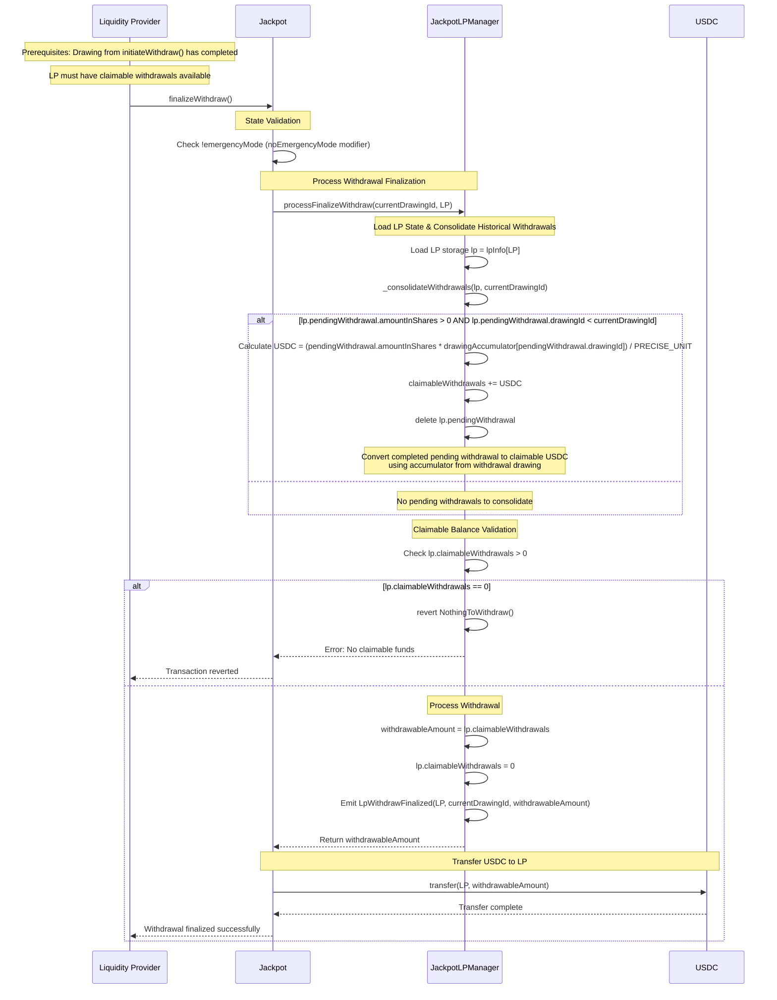

**Key Interactions:**

1. **Prerequisites Check**: Ensures LP has claimable withdrawals available
2. **Historical Consolidation**: Converts any pending withdrawals from completed drawings to claimable USDC
3. **Balance Validation**: Verifies LP has funds available for withdrawal
4. **State Cleanup**: Resets claimable withdrawal balance to zero
5. **USDC Transfer**: Final transfer of calculated USDC amount to LP
6. **Event Emission**: Complete audit trail of withdrawal finalization

**Timing & Prerequisites:**
- **Drawing Completion**: Can only finalize after withdrawal drawing has settled
- **Accumulator Finality**: Uses final accumulator value from completed drawing
- **No Time Limit**: LP can finalize at any time after drawing completion
- **Multiple Calls**: LP can accumulate multiple claimable withdrawals before finalizing

**Economic Mechanics:**
- **Final Price Discovery**: USDC amount determined by `accumulator[withdrawalDrawingId]`
- **Historical Conversion**: Previous pending withdrawals converted at their drawing's final accumulator
- **Clean State**: LP's claimable balance reset to zero after successful transfer
- **Batch Processing**: Multiple historical withdrawals can be finalized in single call

**Security Features:**
- **Emergency Gate**: `noEmergencyMode` prevents finalization during crisis
- **Reentrancy Protection**: `nonReentrant` modifier prevents reentrancy attacks
- **Balance Validation**: Ensures LP has funds before attempting transfer
- **Access Control**: LPManager functions restricted to Jackpot contract
- **State Integrity**: Atomic balance updates prevent double-spending

**State Management:**
- **Individual LP**: `claimableWithdrawals` reset to zero after successful withdrawal
- **Historical Cleanup**: Previous pending withdrawals automatically consolidated
- **Clean Slate**: LP position fully cleaned of historical withdrawal data
- **Event Trail**: Complete withdrawal history preserved via events

**Error Conditions:**
- **No Claimable Funds**: Reverts if LP has no withdrawals ready for finalization
- **Emergency Mode**: Blocked if system is in emergency state
- **Transfer Failure**: USDC transfer failure will revert entire transaction

**Integration Points:**
- **Drawing Settlement**: Depends on completion of drawing settlement process
- **Accumulator Updates**: Uses final accumulator values from settlement
- **USDC Contract**: Direct integration for final fund transfer

#### emergencyWithdrawLP Function Flow

The `emergencyWithdrawLP` function provides a crisis recovery mechanism, allowing LPs to withdraw all their positions when the system is stuck and cannot progress normally.

```mermaid
sequenceDiagram
    participant LP as Liquidity Provider
    participant Jackpot
    participant LPManager as JackpotLPManager
    participant USDC
    
    Note over Jackpot: Prerequisites: Emergency Mode Enabled
    Note over Jackpot: Owner must have called enableEmergencyMode()
    
    LP->>Jackpot: emergencyWithdrawLP()
    
    Note over Jackpot: Emergency Mode Validation
    Jackpot->>Jackpot: Check emergencyMode == true (onlyEmergencyMode modifier)
    
    Note over Jackpot,LPManager: Process Emergency Withdrawal
    Jackpot->>LPManager: emergencyWithdrawLP(currentDrawingId, LP)
    
    Note over LPManager: Load LP State & Initialize Withdrawal Amount
    LPManager->>LPManager: Load LP storage lp = lpInfo[LP]
    LPManager->>LPManager: Initialize withdrawableAmount = 0
    
    alt currentDrawingId == 0 (Bootstrap Phase)
        LPManager->>LPManager: withdrawableAmount += lp.lastDeposit.amount
        LPManager->>LPManager: lpDrawingState[0].pendingDeposits -= lp.lastDeposit.amount
        LPManager->>LPManager: delete lp.lastDeposit
        LPManager->>LPManager: Emit LpWithdrawFinalized(LP, 0, withdrawableAmount)
        LPManager-->>Jackpot: Return withdrawableAmount (simple case)
    else
        Note over LPManager: Process All LP Position Types
        
        Note over LPManager: 1. Consolidate Historical Deposits
        LPManager->>LPManager: _consolidateDeposits(lp, currentDrawingId)
        
        alt lp.lastDeposit.amount > 0 AND lp.lastDeposit.drawingId < currentDrawingId
            LPManager->>LPManager: Calculate shares = (lastDeposit.amount * PRECISE_UNIT) / drawingAccumulator[lastDeposit.drawingId]
            LPManager->>LPManager: consolidatedShares += shares
            LPManager->>LPManager: delete lp.lastDeposit
        end
        
        Note over LPManager: 2. Process Current Round Deposits (USDC)
        alt lp.lastDeposit.amount > 0
            LPManager->>LPManager: withdrawableAmount += lp.lastDeposit.amount
            LPManager->>LPManager: lpDrawingState[currentDrawingId].pendingDeposits -= lp.lastDeposit.amount
            LPManager->>LPManager: delete lp.lastDeposit
            Note over LPManager: Current round deposits returned as USDC
        end
        
        Note over LPManager: 3. Convert Consolidated Shares to USDC
        alt lp.consolidatedShares > 0
            LPManager->>LPManager: Calculate sharesToUsdc = consolidatedShares * drawingAccumulator[currentDrawingId - 1] / PRECISE_UNIT
            LPManager->>LPManager: withdrawableAmount += sharesToUsdc
            LPManager->>LPManager: lpDrawingState[currentDrawingId].lpPoolTotal -= sharesToUsdc
            LPManager->>LPManager: lp.consolidatedShares = 0
            Note over LPManager: Convert shares using previous drawing's accumulator
        end
        
        Note over LPManager: 4. Consolidate Historical Withdrawals
        LPManager->>LPManager: _consolidateWithdrawals(lp, currentDrawingId)
        
        alt lp.pendingWithdrawal.amountInShares > 0 AND lp.pendingWithdrawal.drawingId < currentDrawingId
            LPManager->>LPManager: Calculate USDC = (pendingWithdrawal.amountInShares * drawingAccumulator[pendingWithdrawal.drawingId]) / PRECISE_UNIT
            LPManager->>LPManager: claimableWithdrawals += USDC
            LPManager->>LPManager: delete lp.pendingWithdrawal
        end
        
        Note over LPManager: 5. Process Current Round Pending Withdrawals
        alt lp.pendingWithdrawal.amountInShares > 0
            LPManager->>LPManager: Calculate withdrawalToUsdc = pendingWithdrawal.amountInShares * drawingAccumulator[pendingWithdrawal.drawingId - 1] / PRECISE_UNIT
            LPManager->>LPManager: withdrawableAmount += withdrawalToUsdc
            LPManager->>LPManager: lpDrawingState[currentDrawingId].pendingWithdrawals -= pendingWithdrawal.amountInShares
            LPManager->>LPManager: lpDrawingState[currentDrawingId].lpPoolTotal -= withdrawalToUsdc
            LPManager->>LPManager: delete lp.pendingWithdrawal
            Note over LPManager: Convert pending withdrawals to USDC
        end
        
        Note over LPManager: 6. Add Already Claimable Withdrawals
        LPManager->>LPManager: withdrawableAmount += lp.claimableWithdrawals
        LPManager->>LPManager: lp.claimableWithdrawals = 0
        
        LPManager->>LPManager: Emit LpWithdrawFinalized(LP, currentDrawingId, withdrawableAmount)
        LPManager-->>Jackpot: Return total withdrawableAmount
    end
    
    Note over Jackpot,USDC: Transfer Total Emergency Withdrawal
    Jackpot->>USDC: transfer(LP, withdrawableAmount)
    USDC-->>Jackpot: Transfer complete
    
    Jackpot-->>LP: Emergency withdrawal successful
    
    Note over LP: LP position completely cleared<br/>All deposits, shares, and withdrawals processed
```

**Key Interactions:**

1. **Emergency Gate**: Function only callable when emergency mode is active
2. **Complete Position Liquidation**: Processes all LP position types in single transaction
3. **Historical Consolidation**: Automatic conversion of all historical positions
4. **Global State Consistency**: Updates all relevant global state variables
5. **Position Cleanup**: Complete removal of LP's tracking data
6. **USDC Conversion**: All positions converted to final USDC amount

**Position Types Processed:**
- **Current Round Deposits**: Returned as USDC (no conversion needed)
- **Historical Deposits**: Converted to shares, then to USDC
- **Consolidated Shares**: Converted to USDC using previous accumulator
- **Current Pending Withdrawals**: Converted to USDC using withdrawal drawing accumulator
- **Historical Pending Withdrawals**: Automatically consolidated then added
- **Claimable Withdrawals**: Already in USDC form, added directly

**Economic Mechanics:**
- **Fair Valuation**: Uses appropriate accumulator values for each position type
- **No Loss Recovery**: LPs receive full value of all their positions
- **Current Round Protection**: Pending deposits returned as USDC without risk
- **Historical Pricing**: Shares valued at their original deposit drawing's final accumulator
- **Global Consistency**: All global state variables properly decremented

**Security Features:**
- **Emergency Only**: `onlyEmergencyMode` restricts to crisis situations
- **Complete Liquidation**: Prevents partial recovery that could cause inconsistencies
- **State Integrity**: Atomic updates across all position types and global state
- **Access Control**: LPManager functions restricted to Jackpot contract
- **Comprehensive Cleanup**: Eliminates all traces of LP position

**Crisis Recovery Context:**
- **System Failure**: Used when normal drawing progression is broken
- **Drawing Stuck**: When entropy callbacks fail or settlement cannot complete
- **Owner Activated**: Emergency mode must be manually enabled by contract owner
- **Complete Exit**: LPs can fully exit system during crisis without waiting for fixes

**Special Cases:**
- **Drawing 0**: Special handling for bootstrap phase deposits
- **Mixed Positions**: Handles LPs with multiple position types across drawings
- **Accumulator Dependencies**: Uses different accumulators based on position timing
- **Global State**: Maintains consistency across lpPoolTotal and pendingDeposits/withdrawals

**Risk Mitigation:**
- **Fair Value**: No penalty for emergency withdrawal (LPs get full position value)
- **Crisis Response**: Provides liquidity escape hatch during system failures
- **State Safety**: Complete position cleanup prevents future inconsistencies
- **Owner Control**: Emergency activation requires governance decision

### Referrer Flows

#### claimReferralFees Function Flow

The `claimReferralFees` function allows referrers to claim accumulated fees from ticket purchases and winning referral shares.

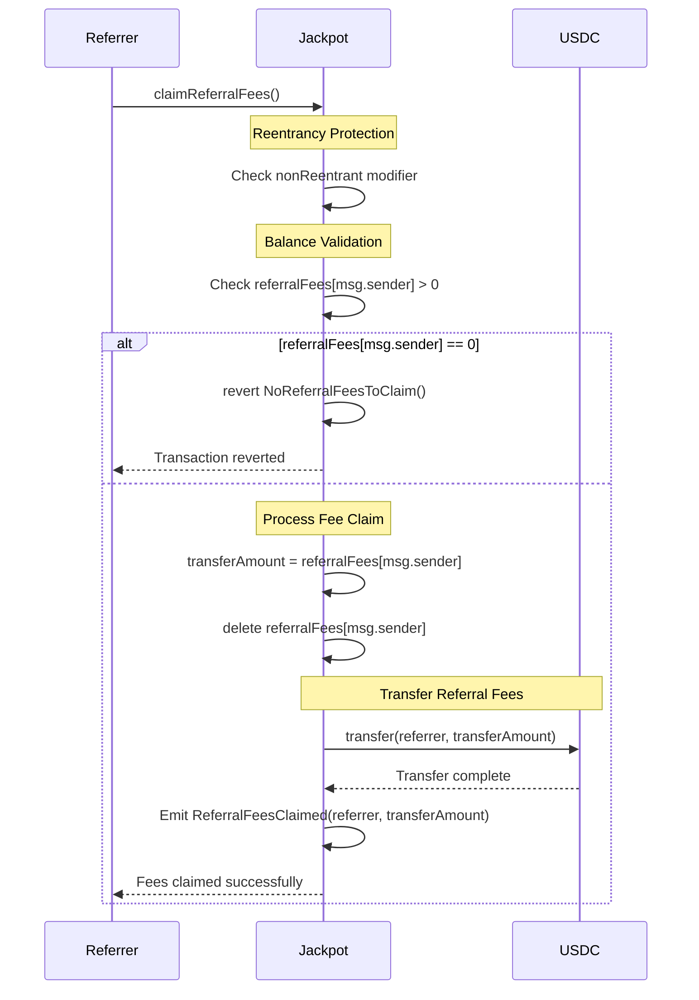

**Key Interactions:**

1. **Balance Validation**: Ensures referrer has accumulated fees to claim
2. **Atomic State Update**: Balance cleared before USDC transfer (prevents reentrancy)
3. **USDC Transfer**: Direct transfer of accumulated referral fees
4. **Event Emission**: Complete audit trail of fee claims
5. **Clean State**: Referrer balance reset to zero after successful claim

**Fee Accumulation Sources:**
- **Purchase Fees**: Accumulated during `buyTickets()` when tickets purchased with referral schemes
- **Winning Shares**: Accumulated during `claimWinnings()` when referred tickets win prizes
- **Split Distribution**: Fees shared among multiple referrers based on `referralSplit` weights

**Economic Mechanics:**
- **Purchase Referrals**: `ticketsValue * referralFee / PRECISE_UNIT` distributed among referrers
- **Winning Referrals**: `winningAmount * referralWinShare / PRECISE_UNIT` distributed among referrers
- **Split Calculation**: `totalReferralAmount * referrerSplit[i] / PRECISE_UNIT` per referrer
- **Accumulation**: All fees accumulate in `referralFees[referrerAddress]` mapping

**Security Features:**
- **Reentrancy Protection**: `nonReentrant` modifier prevents reentrancy attacks
- **Balance Validation**: Ensures referrer has fees before attempting transfer
- **State-First Pattern**: Balance cleared before external call to prevent double-claiming
- **Direct Transfer**: No intermediary contracts or complex logic

**State Management:**
- **Individual Tracking**: Each referrer has separate balance in `referralFees` mapping
- **Clean Slate**: Balance reset to zero after successful claim
- **No Time Limits**: Referrers can claim accumulated fees at any time
- **Persistent Accumulation**: Fees accumulate across multiple transactions until claimed

**Integration Points:**
- **buyTickets()**: Fees credited during ticket purchases with referral schemes
- **claimWinnings()**: Additional fees credited from winning ticket referral shares
- **USDC Contract**: Direct integration for fee transfers

**Error Conditions:**
- **No Fees**: Reverts if referrer has zero accumulated fees
- **Transfer Failure**: USDC transfer failure will revert entire transaction

**Referral System Context:**
- **Scheme-Based**: Fees tied to specific referral schemes with custom splits
- **Multi-Referrer**: Single scheme can have multiple referrers with weighted distributions
- **Two Revenue Streams**: Purchase fees (immediate) + winning shares (delayed)
- **Configurable Rates**: `referralFee` and `referralWinShare` set by governance

**Gas Efficiency:**
- **Simple Logic**: Minimal computational requirements
- **Single Transfer**: All accumulated fees claimed in one transaction
- **State Cleanup**: Efficient storage deletion after claim

### Drawing Flows

#### Complete Drawing Flow: runJackpot + scaledEntropyCallback

The drawing process consists of two separate transactions that together complete a jackpot drawing: keeper-initiated `runJackpot` and Pyth-initiated `scaledEntropyCallback` via `ScaledEntropyProvider`.

```mermaid
sequenceDiagram
    participant Keeper
    participant Jackpot
    participant EntropyProvider as ScaledEntropyProvider
    participant PythNetwork as Pyth Network
    participant LPManager as JackpotLPManager
    participant PayoutCalc as PayoutCalculator
    
    Note over Keeper, PayoutCalc: TRANSACTION 1: Drawing Initiation (runJackpot)
        
        Keeper->>Jackpot: runJackpot() {value: entropyFee}
        
        Note over Jackpot: Pre-Drawing Validation
        Jackpot->>Jackpot: Load currentDrawingState = drawingState[currentDrawingId]
        Jackpot->>Jackpot: Check !currentDrawingState.jackpotLock
        Jackpot->>Jackpot: Check currentDrawingState.drawingTime < block.timestamp
        Jackpot->>Jackpot: Check !emergencyMode
        
        Note over Jackpot: Lock Drawing
        Jackpot->>Jackpot: _lockJackpot()
        Jackpot->>Jackpot: drawingState[currentDrawingId].jackpotLock = true
        Jackpot->>Jackpot: Emit JackpotLocked(currentDrawingId)
        
        Note over Jackpot: Entropy Setup
        Jackpot->>Jackpot: entropyGasLimit = entropyBaseGasLimit + entropyVariableGasLimit * bonusballMax
        Jackpot->>EntropyProvider: fee = entropy.getFee(entropyGasLimit)
        EntropyProvider-->>Jackpot: Return required fee
        Jackpot->>Jackpot: Validate msg.value >= fee
        
        alt msg.value > fee
            Jackpot->>Keeper: Refund excess fee (msg.value - fee)
        end
        
        Note over Jackpot: Prepare Entropy Requests
        Jackpot->>Jackpot: Create setRequests[2]
        Jackpot->>Jackpot: setRequests[0] = {samples: 5, minRange: 1, maxRange: ballMax, withReplacement: false}
        Jackpot->>Jackpot: setRequests[1] = {samples: 1, minRange: 1, maxRange: bonusballMax, withReplacement: false}
        
        Note over Jackpot,PythNetwork: Initiate Entropy Request
        Jackpot->>EntropyProvider: requestAndCallbackScaledRandomness{value: fee}(<br/>entropyGasLimit, setRequests, address(this),<br/>scaledEntropyCallback.selector, bytes(""))
        
        EntropyProvider->>EntropyProvider: Store pending request with callback details
        EntropyProvider->>PythNetwork: requestV2{value: fee}(entropyProvider, entropyGasLimit)
        PythNetwork-->>EntropyProvider: Return sequence ID
        EntropyProvider-->>Jackpot: Request submitted
        
        Jackpot->>Jackpot: Emit JackpotRunRequested(currentDrawingId, entropyGasLimit, fee)
        
        Jackpot-->>Keeper: Transaction complete (drawing locked, entropy requested)
    
    Note over Keeper, PayoutCalc: TRANSACTION 2: Drawing Settlement (scaledEntropyCallback)
        Note over PythNetwork: Pyth Network generates entropy and initiates callback
        
        PythNetwork->>EntropyProvider: entropyCallback(sequence, provider, randomNumber)
        
        Note over EntropyProvider: Process Entropy & Generate Scaled Numbers
        EntropyProvider->>EntropyProvider: Load pending request for sequence
        EntropyProvider->>EntropyProvider: _getScaledRandomness(randomNumber, setRequests)
        EntropyProvider->>EntropyProvider: Generate normal balls [1-ballMax] without replacement (5 numbers)
        EntropyProvider->>EntropyProvider: Generate bonusball [1-bonusballMax] without replacement (1 number)
        EntropyProvider->>EntropyProvider: Delete pending request
        
        Note over EntropyProvider,Jackpot: Execute Callback to Jackpot
        EntropyProvider->>Jackpot: scaledEntropyCallback(sequence, scaledRandomNumbers, context)
        
        Note over Jackpot: Validate Callback State
        Jackpot->>Jackpot: Check msg.sender == entropy (onlyEntropy modifier)
        Jackpot->>Jackpot: Check currentDrawingState.jackpotLock == true
        
        Note over Jackpot: Process Winning Numbers & Calculate Winnings
        Jackpot->>Jackpot: winningNumbers = _calculateDrawingUserWinnings(currentDrawingState, _randomNumbers)
        Jackpot->>Jackpot: currentDrawingState.winningTicket = winningNumbers
        Jackpot->>Jackpot: Calculate total user winnings from all tier payouts
        
        Note over Jackpot: Protocol Fee Transfer
        Jackpot->>Jackpot: protocolFeeAmount = _transferProtocolFee(lpEarnings, drawingUserWinnings)
        Jackpot->>Jackpot: Transfer protocol fees to protocol fee recipient
        
        Note over Jackpot,LPManager: Drawing Settlement via LP Manager
        Jackpot->>LPManager: processDrawingSettlement(<br/>currentDrawingId, lpEarnings, drawingUserWinnings, protocolFeeAmount)
        
        LPManager->>LPManager: Calculate new LP value = lpPoolTotal + lpEarnings - userWinnings - protocolFee
        LPManager->>LPManager: Process pending deposits → consolidated shares
        LPManager->>LPManager: Process pending withdrawals using current accumulator
        LPManager->>LPManager: Calculate newAccumulator = PRECISE_UNIT * newLPValue / totalShares
        LPManager->>LPManager: Store drawingAccumulator[currentDrawingId] = newAccumulator
        LPManager->>LPManager: Initialize next drawing LP state
        LPManager-->>Jackpot: Return (newLPValue, newAccumulator)
        
        Note over Jackpot: Initialize New Drawing
        Jackpot->>Jackpot: _setNewDrawingState(newLPValue, drawingTime + drawingDurationInSeconds)
        Jackpot->>Jackpot: currentDrawingId++
        Jackpot->>LPManager: initializeDrawingLP(currentDrawingId, newLPValue)
        Jackpot->>Jackpot: Initialize new DrawingState with fresh parameters
        Jackpot->>Jackpot: Calculate new prizePool = newLPValue * (1 - reserveRatio)
        Jackpot->>Jackpot: Calculate new bonusballMax for optimal LP edge
        Jackpot->>Jackpot: Set jackpotLock = false (unlock new drawing)
        
        Jackpot->>Jackpot: Emit JackpotSettled(<br/>completedDrawingId, globalTicketsBought,<br/>drawingUserWinnings, bonusball, winningNumbers, newAccumulator)
        
        Jackpot-->>EntropyProvider: Callback complete
        EntropyProvider-->>PythNetwork: Settlement acknowledged
```

**Key Interactions:**

1. **Two-Transaction Process**: Drawing initiation and settlement happen in separate transactions
2. **External Dependency**: Relies on Pyth Network for cryptographically secure randomness
3. **State Locking**: Drawing locked during entropy generation to prevent interference
4. **Entropy Configuration**: Dynamic gas limits based on bonusball range complexity
5. **Settlement Integration**: LP Manager handles complex financial settlement
6. **Drawing Transition**: Seamless transition from completed drawing to new drawing state

**Transaction 1: runJackpot (Keeper-Initiated):**
- **Timing Validation**: Ensures drawing time has passed
- **Drawing Lock**: Prevents additional purchases/LP operations during drawing
- **Entropy Request**: Configures randomness generation for normal balls + bonusball
- **Fee Management**: Validates entropy fees and refunds excess payments
- **State Persistence**: Drawing remains locked until callback completion

**Transaction 2: scaledEntropyCallback (Pyth-Initiated):**
- **Entropy Processing**: Converts raw randomness to jackpot number ranges
- **Winner Calculation**: Determines winning numbers and calculates all tier payouts
- **Financial Settlement**: Processes LP earnings, user winnings, and protocol fees
- **LP State Updates**: Updates accumulator values and LP pool for next drawing
- **Drawing Transition**: Initializes new drawing with updated parameters

**Security Features:**
- **Access Control**: `onlyEntropy` ensures only ScaledEntropyProvider can call callback
- **State Validation**: Multiple checks ensure proper drawing state transitions
- **Reentrancy Protection**: `nonReentrant` modifiers prevent reentrancy attacks
- **Lock Mechanism**: Drawing lock prevents state manipulation during processing
- **Fee Validation**: Ensures sufficient entropy fees while refunding excess

**Economic Flow:**
- **Prize Pool**: Determined by LP value and reserve ratio
- **LP Earnings**: Accumulated from ticket sales and duplicate ticket handling
- **User Winnings**: Calculated based on tier payouts and winning combinations
- **Protocol Fees**: Extracted from LP earnings before settlement
- **Accumulator Updates**: Share pricing reflects drawing performance

**External Dependencies:**
- **Pyth Network**: Provides cryptographically secure randomness
- **Keeper Network**: Initiates drawings when timing conditions are met
- **ScaledEntropyProvider**: Bridges between Pyth and Jackpot with proper scaling
- **LP Manager**: Handles complex financial state transitions
- **Payout Calculator**: Provides tier-specific payout amounts

**Failure Scenarios:**
- **Entropy Timeout**: Drawing remains locked if Pyth callback fails
- **Insufficient Fees**: Transaction reverts if entropy fee not covered
- **Callback Failure**: Drawing can be unlocked manually or via emergency mode
- **Settlement Errors**: LP Manager validation prevents invalid state transitions

### Initialization Flows

The MegaPot V2 system requires a three-step initialization process to set up external dependencies, enable LP deposits, and activate jackpot operations.

#### initialize Function Flow

The `initialize` function is the first step, establishing connections to all external contracts required for jackpot operations.

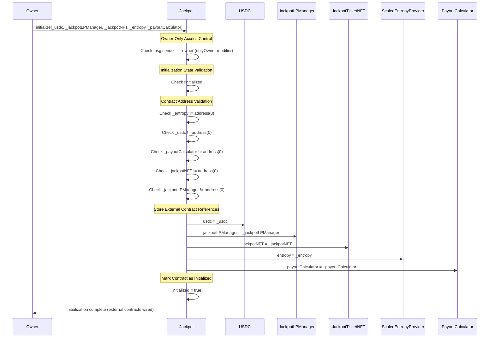

**Key Interactions:**

1. **Access Control**: Owner-only function for secure initialization
2. **State Validation**: Prevents re-initialization of already initialized contract
3. **Address Validation**: Ensures all external contracts are valid addresses
4. **Reference Storage**: Establishes permanent connections to external dependencies
5. **Initialization Flag**: Sets initialized flag to enable subsequent initialization steps

#### initializeLPDeposits Function Flow

The `initializeLPDeposits` function is the second step, enabling LP deposit functionality and setting up initial accumulator values.

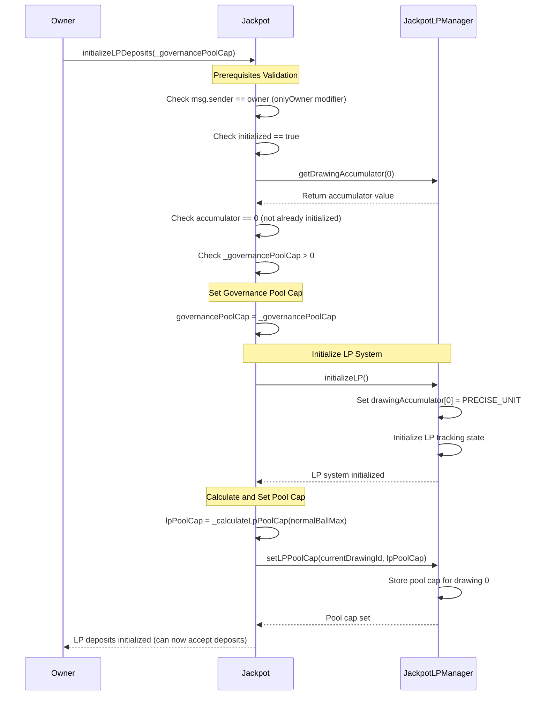

**Key Interactions:**

1. **Sequential Dependency**: Requires successful completion of `initialize()` first
2. **One-Time Setup**: Prevents re-initialization of LP deposit system
3. **Governance Pool Cap**: Sets maximum LP pool size limit
4. **Accumulator Bootstrap**: Initializes drawing 0 accumulator to PRECISE_UNIT
5. **Pool Cap Calculation**: Determines optimal pool cap based on jackpot parameters

#### initializeJackpot Function Flow

The `initializeJackpot` function is the final step, activating jackpot operations and creating the first drawing state.

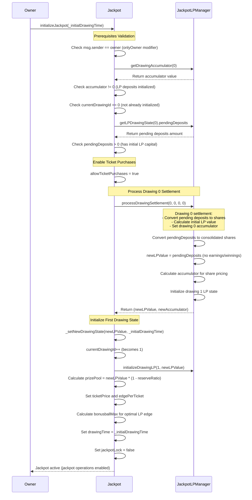

**Key Interactions:**

1. **Sequential Dependency**: Requires successful completion of previous initialization steps
2. **LP Capital Validation**: Ensures sufficient initial LP deposits exist
3. **Drawing 0 Settlement**: Processes bootstrap deposits to establish initial LP value
4. **Ticket Purchase Activation**: Enables users to purchase jackpot tickets
5. **First Drawing Creation**: Establishes drawing 1 with proper parameters and timing

**Complete Initialization Sequence:**

The three initialization functions must be called in order:

1. **initialize()**: Wire external contract dependencies
2. **initializeLPDeposits()**: Enable LP deposits and set pool caps
3. **initializeJackpot()**: Activate jackpot with initial drawing state

**Security Features:**
- **Owner-Only Access**: All functions restricted to contract owner
- **Sequential Requirements**: Each step validates completion of previous steps
- **One-Time Execution**: Prevents re-initialization and state corruption
- **Address Validation**: Ensures valid external contract addresses
- **State Consistency**: Maintains proper system state throughout initialization

**Economic Initialization:**
- **LP Bootstrap**: Initial LP deposits become the foundation of the jackpot economy
- **Prize Pool Creation**: First drawing prize pool calculated from initial LP value
- **Accumulator Setup**: Share pricing mechanism established for LP operations
- **Parameter Calculation**: Optimal jackpot parameters computed for fair operation

### Integration Points
- **Pyth Network**: External entropy source via `IEntropyV2` interface
- **USDC Token**: Primary currency for tickets and payouts via `IERC20`
- **OpenZeppelin**: Access control, reentrancy protection, EIP-712 signatures

---

## 3. Core Economic Model

### Bonusball Range Dynamics
- For each new drawing, `bonusballMax` is computed to help preserve the LP edge: `bonusballMax = max(bonusballMin, ceil(minNumberTickets / C(normalBallMax, 5)))`, where `minNumberTickets = prizePool / ((1 - lpEdgeTarget) * ticketPrice)`.
- This ties the number of bonusball choices to expected ticket volume and LP edge policy.

### Parameters & Units Reference
- Percent/scalar units use `PRECISE_UNIT = 1e18` (e.g., `lpEdgeTarget`, `reserveRatio`, `referralFee`, `referralWinShare`, `protocolFee`).
- USDC amounts have 6 decimals (ticketPrice, minimumPayout, protocolFeeThreshold).
- Referral split weights are `PRECISE_UNIT`-scaled (must sum to `PRECISE_UNIT`).
- Entropy gas limit is a `uint32` (`entropyBaseGasLimit`) passed to the entropy provider.

### Liquidity Provider Mechanics
- **Accumulator Pricing**: LP shares valued using accumulator that tracks value changes over time
- **Deposit Cycles**: LPs deposit during active drawing, shares calculated at drawing end taking into account results from drawing
- **Withdrawal Process**: Two-step withdrawal (initiate → finalize) with timing constraints. LPs are exposed to outcome of drawing during which they initiate withdraw but none after that
- **Edge Targeting**: System maintains target LP profit margin by issuing (1 + lpEdge) times more tickets by value than the size of the prize pool. For duplicate tickets ticketPrice * (1-lpEdge) is added, the effect being the LP earns (ticketPrice - referralFee) and the prize pool only adds ticketPrice * (1-lpEdge). The LP earnings will outpace the addition to the prize pool thus keeping EV in line.

### Fee Structure
- **Referral Fees**: Configurable percentage of ticket price distributed to referrers when a ticket is bought
- **Referral Win Share**: Configurable percentage of all winning tickets claimed by users. If no referrer is set the referrer fee is returned to the LP pool.
- **Protocol Fees**: Taken from LP profits above threshold, not from ticket sales directly
- **LP Edge**: Target profit margin for LPs, extracted from ticket revenue before prize pool

### Prize Pool & Cashflow Dynamics
- The per-drawing prize pool is derived from LP value: `prizePool = lpValue * (1 - reserveRatio)`.
- Ticket revenue flows to `lpEarnings` (minus referral fees). On duplicate tickets, prizePool increases by `ticketPrice * (1 - lpEdgeTarget)` to preserve LP edge.
- At settlement: `postDrawLpValue = prevLp + lpEarnings - userWinnings - protocolFeeAmount`. Protocol fees are charged only if `lpEarnings > userWinnings` and the difference exceeds `protocolFeeThreshold`.
- Final payouts are the sum of guaranteed minimums plus premium allocation across tiers.

### Cross-Chain Economics
- Bridge manager acts as custodian, holding tickets and executing fund transfers
- Winning claims automatically bridge funds to destination chain
- Bridge fees handled by external providers, not deducted from winnings

### LP Accumulator Math
- Accumulator update (for drawingId > 0): `newAccumulator = (prevAccumulator * postDrawLpValue) / prevLpTotal`.
- Pending withdrawals convert at `newAccumulator`; `newLPValue = postDrawLpValue + pendingDeposits - (pendingWithdrawals * newAccumulator / PRECISE_UNIT)`.
- LP shares consolidate across drawings using the accumulator, ensuring time-weighted pricing.

### Referral Scheme Semantics
- Referral scheme ID: `keccak256(abi.encode(referrers, referralSplits))`, with splits in `PRECISE_UNIT` that must sum to `PRECISE_UNIT`.
- Purchase referrals: total referral fee = `ticketsValue * referralFee`; credited to referrers by split.
- Winnings referrals: a portion of each winning  ticket(`referralWinShare`) is split among referrers; if no scheme, this share returns to `lpEarnings` for the drawing the ticket was claimed in.

---

## 4. Drawing Parameterization & Economic Dynamics

The MegaPot V2 system employs sophisticated automated mechanisms to balance game economics between drawings. The core principle is maintaining LP profitability by automatically adjusting game difficulty (bonusball count) based on prize pool size and target profit margins. A model of drawing parameterization and payout calculations (next section) can be found A full model of prize tier math can be accessed [here](https://docs.google.com/spreadsheets/d/132laZVVmwy5Y35JGzJk_birru2fUUjpNRzH9JDEUMz4/edit?usp=sharing).

### Drawing State Transitions

Each drawing transition occurs via the `_setNewDrawingState()` function, executed at the end of `scaledEntropyCallback()`. This process involves both parameter inheritance and dynamic recalculation:

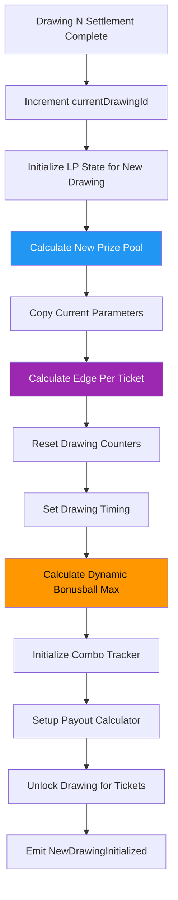

**Parameter Flow Categories:**

1. **Inherited Parameters** (copied from global state):
   - `ticketPrice` → `newDrawingState.ticketPrice`
   - `normalBallMax` → `newDrawingState.ballMax`
   - Current timestamp + `drawingDurationInSeconds` → `drawingTime`
   - `referralWinShare` → `newDrawingState.referralWinShare`

2. **Calculated Parameters** (derived from LP state):
   - `prizePool = newLpValue * (PRECISE_UNIT - reserveRatio) / PRECISE_UNIT`
   - `edgePerTicket = lpEdgeTarget * ticketPrice / PRECISE_UNIT`
   - **`bonusballMax`** → **dynamically computed to guarantee LP edge**

3. **Reset Parameters** (initialized for new drawing):
   - `globalTicketsBought = 0`
   - `lpEarnings = 0`
   - `jackpotLock = false`

### Dynamic Bonusball Calculation - LP Edge Guarantee

The most critical economic mechanism ensures LPs receive at least their target profit margin by automatically adjusting game difficulty:

**Mathematical Formula:**
```solidity
combosPerBonusball = C(normalBallMax, NORMAL_BALL_COUNT)
minNumberTickets = prizePool * PRECISE_UNIT / ((PRECISE_UNIT - lpEdgeTarget) * ticketPrice)
bonusballMax = max(bonusballMin, ceil(minNumberTickets / combosPerBonusball))
```

**Economic Logic:**

The system calculates exactly how many tickets must be sold to guarantee the LP edge, then ensures the game has **at least** that many possible ticket combinations:

- **LP Edge Target**: LPs should earn `prizePool * lpEdgeTarget` profit
- **Required Revenue**: `prizePool / (1 - lpEdgeTarget)` total ticket sales needed
- **Minimum Tickets**: Divide required revenue by ticket price
- **Bonusball Rounding**: Round UP to ensure sufficient ticket combinations exist

**Worked Example:**
```
Given:
- prizePool = 5,000,000 USDC
- lpEdgeTarget = 0.25 (25%)
- ticketPrice = 1 USDC  
- normalBallMax = 35
- bonusballMin = 10

Calculation:
1. combosPerBonusball = C(35,5) = 324,632
2. minNumberTickets = 5,000,000 / (1-0.25) = 5,000,000 / 0.75 = 6,666,667 tickets
3. bonusballFloat = 6,666,667 / 324,632 = 20.54
4. bonusballMax = max(10, ceil(20.54)) = 21

Economic Result:
- Total possible tickets = 324,632 * 21 = 6,817,272
- If ALL tickets sell: Revenue = 6,817,272 USDC
- LP profit = 6,817,272 - 5,000,000 = 1,817,272 USDC
- **Actual LP profit margin = 1,817,272/6,817,272 = 26.66% due to ceil() rounding**
```

**Key Insight**: The `ceil()` function ensures LPs always get **at least** their target edge, often significantly more. This conservative approach protects LP profitability even when ticket sales are strong.

### LP Edge Preservation Mechanisms

The system maintains LP profitability through multiple interconnected mechanisms:

**Primary Edge Protection:**

1. **Prize Pool Limitation**: `prizePool = lpValue * (1 - reserveRatio)` keeps prizes below total LP capital
2. **Duplicate Handling**: Extra tickets add `ticketPrice * (1 - lpEdgeTarget)` to prize pool, preserving edge
3. **Conservative Rounding**: Bonusball ceil() ensures minimum edge is always exceeded

**Edge Calculation Per Drawing:**
```
Expected LP Profit = totalTicketsSold * lpEdgeTarget * ticketPrice
Actual Payouts = sum(tierPayouts) across all winning tickets
LP Net = Expected Profit - Actual Payouts + duplicateTicketBonus
```

### Parameter Dependencies & Mid-Drawing Changes

**Governance Parameter Timing Effects:**

| Parameter | Current Drawing | Next Drawing | Immediate Impact |
|-----------|----------------|--------------|------------------|
| `ticketPrice` | ✗ (frozen in drawing state) | ✓ (affects parameterization) | Pool cap recalculation |
| `normalBallMax` | ✗ (frozen in tracker/drawing state) | ✓ (affects parameterization) | Pool cap recalculation |
| `lpEdgeTarget` | ✗ | ✓ (affects bonusball calc) | Pool cap recalculation |
| `reserveRatio` | ✗ | ✓ (affects prize pool) | Pool cap recalculation |
| `bonusballMin` | ✗ | ✓ (affects minimum difficulty) | None |
| `referralWinShare` | ✗ | ✓ (frozen in drawing state) | None |


**Critical Timing Considerations:**

1. **Drawing Parameter Isolation**: All drawing parameters (`ticketPrice`, `normalBallMax`, `bonusballMax`, `referralWinShare`) are frozen when the drawing is initialized
2. **Mid-Drawing Safety**: Global parameter changes during active drawings do NOT affect current ticket purchases
3. **Next Drawing Impact**: All parameter changes only take effect in the next drawing parameterization 
4. **Pool Cap Updates**: `ticketPrice`, `normalBallMax`, `lpEdgeTarget`, and `reserveRatio` changes trigger immediate pool cap recalculation for future deposits

### Potential Economic Attack Vectors

**Parameter Manipulation Risks:**

1. **Bonusball Gaming**: Can governance time `bonusballMin` changes to create favorable conditions?
2. **Pool Timing**: Can large LP deposits be timed to exploit parameterization cycles?
3. **Edge Erosion**: Under what extreme conditions might actual edge fall below target?
4. **Feedback Disruption**: Can external actions break the self-regulating cycles?

**Mathematical Edge Cases:**

1. **Integer Bounds**: `bonusballMax` is `uint8` - maximum value 255
2. **Division Precision**: Prize pool calculations use integer division - verify rounding
3. **Ceiling Overflow**: `Math.ceilDiv()` could theoretically overflow on extreme inputs
4. **Combination Limits**: Very high `normalBallMax` could make `C(n,5)` exceed uint256

**Stability Verification Points:**

- **Edge Guarantee**: Verify `ceil()` math ensures minimum LP profit in all scenarios
- **Parameter Bounds**: Confirm all calculations stay within type limits
- **Rounding Conservation**: Ensure all rounding favors LP solvency over player winnings

---

## 5. Tier Payout Calculation & Guaranteed Minimums

The MegaPot V2 payout system implements a sophisticated two-tier structure combining guaranteed minimum payouts with proportional premium pool distribution. This system ensures predictable returns for winners while allowing prize pools to scale with ticket sales.

### Tier Structure & Classification

The system defines 12 payout tiers based on jackpot match combinations:

**Tier Calculation Formula:**
```
tierId = normalMatches * 2 + (bonusballMatch ? 1 : 0)
```

**Complete Tier Mapping:**
```
Tier 0:  0 normal matches, no bonusball  → 0*2 + 0 = 0
Tier 1:  0 normal matches, with bonusball → 0*2 + 1 = 1
Tier 2:  1 normal match, no bonusball     → 1*2 + 0 = 2
Tier 3:  1 normal match, with bonusball   → 1*2 + 1 = 3
Tier 4:  2 normal matches, no bonusball   → 2*2 + 0 = 4
Tier 5:  2 normal matches, with bonusball → 2*2 + 1 = 5
...
Tier 10: 5 normal matches, no bonusball   → 5*2 + 0 = 10
Tier 11: 5 normal matches, with bonusball → 5*2 + 1 = 11 (JACKPOT)
```

### Two-Tier Payout System

Each tier's final payout combines two components:

**Payout Components:**
1. **Guaranteed Minimum**: Fixed amount per winning ticket (if tier is eligible)
2. **Premium Allocation**: Proportional share of remaining prize pool after minimums

**Final Tier Payout Formula:**
```solidity
tierPayout = (minPayoutTiers[i] ? minPayout : 0) + premiumTierPayoutAmount

where:
premiumTierPayoutAmount = (remainingPrizePool * premiumTierWeights[i]) / (PRECISE_UNIT * totalTierWinners[i])
```
 In order for guaranteed minimum payments to be made there must be enough capital in the prize pool to pay out the total guaranteed minimum payments plus a governance-defined minimum premium tier allocation. If the prize pool cannot support these payouts then only premium tier winners will receive funds. This ensures that premium tiers always earn more than lower tiers.

### Payout Calculation Process

The `calculateAndStoreDrawingUserWinnings()` function executes a multi-step process:

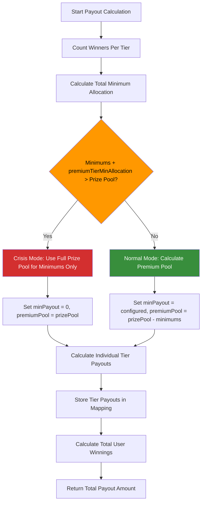

**Step-by-Step Breakdown:**

1. **Winner Counting**: Calculate total winning tickets per tier (including LP-owned and duplicates)
   ```solidity
   tierWinners[i] = calculateTierTotalWinningCombos(matches, normalMax, bonusballMax, hasBonusball) + dupResult[i]
   ```

2. **Minimum Allocation**: Sum guaranteed minimums across all eligible tiers
   ```solidity
   minimumPayoutAllocation += tierWinners[i] * minPayout  // for eligible tiers only
   ```

3. **Crisis Detection**: Check if minimums exceed available prize pool
   ```solidity
   if (minimumPayoutAllocation + (_prizePool * premiumTierMinAllocation / PRECISE_UNIT) > prizePool) {
       // Crisis mode: scale down minimums proportionally
       remainingPrizePool = prizePool;
       effectiveMinPayout = 0;  // Disable minimums, use full pool for premium
   } else {
       // Normal mode: honor minimums, allocate remainder as premium
       remainingPrizePool = prizePool - minimumPayoutAllocation;
       effectiveMinPayout = minPayout;
   }
   ```

4. **Tier Payout Calculation**: Combine minimums with premium allocation
   ```solidity
   premiumAmount = (remainingPrizePool * premiumTierWeights[i]) / (PRECISE_UNIT * tierWinners[i]);
   tierPayout = (minPayoutTiers[i] ? effectiveMinPayout : 0) + premiumAmount;
   ```

### Crisis Mode: When Minimums Exceed Prize Pool

**Trigger Condition:**
```solidity
if (minimumPayoutAllocation + (_prizePool * premiumTierMinAllocation / PRECISE_UNIT) > prizePool) 
```

**Crisis Mode Behavior:**
- **Minimum Payouts**: Disabled (set to 0)
- **Premium Pool**: Uses entire prize pool
- **Distribution**: All funds distributed proportionally via premium weights
- **Effect**: No guaranteed minimums, pure proportional allocation

**Example Crisis Scenario:**
```
Given:
- prizePool = 1,000 USDC
- minPayout = 100 USDC per ticket
- premiumTierMinAllocation = 10%
- Tier 11 (jackpot) winners: 15 tickets
- Total minimum allocation = 15 * 100 + 100 = 1,600 USDC

Result: 1,600 > 1,000 → Crisis Mode
- effectiveMinPayout = 0
- remainingPrizePool = 1,000 USDC (full amount)
- All 1,000 USDC distributed via premium weights only
```

**Crisis Mode Implications:**
- **Player Impact**: No guaranteed minimums, but still receive proportional payouts
- **LP Protection**: Prevents over-paying winners beyond available funds
- **Economic Balance**: Maintains system solvency during extreme winning scenarios
- **Audit Concern**: Verify crisis mode doesn't create exploitable conditions

### Winner Counting & LP Integration

**Total Winners Calculation:**
```solidity
tierWinners[i] = calculatedWinningCombos + dupResult[i]
```

**Components Explained:**
- **calculatedWinningCombos**: Mathematical calculation of possible winning combinations for this tier
- **dupResult[i]**: Actual duplicate tickets sold for this exact combination

**LP Winner Integration:**
- **Inclusion**: LP-owned winning tickets included in `tierWinners[i]` count
- **Payout Allocation**: Premium pool divided among ALL winners (user + LP owned)
- **Economic Effect**: LP-owned winning tickets effectively return funds to LP pool
- **Anti-Dilution**: Prevents LP tickets from diluting user payouts

### Mathematical Edge Cases & Verification

**Critical Verification Points:**

1. **Overflow Protection**:
   ```solidity
   // Verify: premiumTierWeights[i] * remainingPrizePool doesn't overflow
   // Max safe: remainingPrizePool < 2^256 / max(premiumTierWeights[i])
   ```

2. **Division by Zero**:
   ```solidity
   // Protected by: if (_tierWinners[i] != 0) check before division
   ```

3. **Weight Sum Validation**:
   ```solidity
   // Verify: sum(premiumTierWeights) == PRECISE_UNIT (enforced in constructor)
   ```

4. **Crisis Mode Math**:
   ```solidity
   // Verify: total distributed in crisis mode <= prizePool
   // Check: sum(tierPayout * userWinners[i]) <= prizePool
   ```

### Potential Attack Vectors

**Economic Manipulation Risks:**

1. **Minimum Payout Gaming**: Can governance set minimums to trigger crisis mode intentionally?
2. **Weight Manipulation**: Can premium weight changes between drawings create arbitrage?
3. **LP Winner Exploitation**: Can LPs manipulate ticket purchases to benefit from their own winning tickets?
4. **Crisis Timing**: Can attackers force crisis mode during specific drawings?

**Audit Verification Requirements:**

- **Payout Consistency**: Verify tier payouts match stored calculations
- **Total Conservation**: Confirm total payouts never exceed prize pool
- **Crisis Handling**: Test extreme scenarios where minimums exceed pools
- **Weight Validation**: Ensure premium weights always sum to PRECISE_UNIT
- **LP Integration**: Verify LP-owned winners don't create accounting errors

**Mathematical Invariants:**
```
1. sum(tierPayout * (uniqueResult[i] + dupResult[i])) <= prizePool (always)
2. sum(premiumTierWeights) == PRECISE_UNIT (configuration)
3. tierPayout >= 0 for all tiers (non-negative payouts)
4. In crisis mode: effectiveMinPayout == 0 AND remainingPrizePool == prizePool
```

## 6. System Accounting & Balance Reconciliation

The MegaPot V2 system maintains complex accounting relationships across multiple contracts and user states. This section provides auditors with concrete methods to verify system solvency and accounting integrity.

### Section 1: LP Pool Reconciliation

**Objective**: Show how to recreate total `lpPoolSize` from individual LP positions

#### LP State Components

Each individual LP position consists of:
```solidity
struct LP {
    uint256 consolidatedShares;     // Past drawings converted to shares
    DepositInfo lastDeposit;        // Current drawing USDC deposit
    WithdrawalInfo pendingWithdrawal; // Shares queued for withdrawal  
    uint256 claimableWithdrawals;   // USDC ready to claim
}

struct LPDrawingState {
    uint256 lpPoolTotal;      // Active LP value in this drawing
    uint256 pendingDeposits;  // Sum of all LP deposits this drawing
    uint256 pendingWithdrawals; // Sum of all LP withdrawal requests (in shares)
}
```

#### Reconciliation Formula

The total LP pool value can be reconstructed from individual LP positions:
```solidity
// For drawing d, LP pool reconstruction (active pool only):
lpPoolTotal[d] = 
    Σ(LP.consolidatedShares * accumulator[LP.lastConsolidatedDrawing]) +
    Σ(prior_deposits * accumulator[d-1] / accumulator[deposit_drawing]) -
    (pendingWithdrawals[d] * accumulator[d-1])

// Note: pendingDeposits[d] are NOT included in lpPoolTotal[d] 
// They remain separate until next drawing settlement

// Total contract LP obligations:
totalLPObligations = 
    lpPoolTotal[currentDrawing] +
    pendingDeposits[currentDrawing] +           // Current deposits not yet in pool
    Σ(LP.claimableWithdrawals) +
    Σ(prior_pendingWithdrawals * accumulator[withdrawal_drawing])
```

#### Audit Verification Points

- **Individual Position Integrity**: Each LP's total value matches sum of components
- **Accumulator Consistency**: Share pricing follows accumulator math precisely  
- **Timing Validation**: Deposits/withdrawals processed in correct drawing cycles
- **Pool Cap Compliance**: Total pool never exceeds governance limits

### Section 2: USDC Balance Reconciliation

**Objective**: Show how contract USDC balance maps to all outstanding obligations

#### Outstanding Obligations Breakdown

```solidity
// All USDC obligations the contract must honor:
totalUSDCObligations = 
    totalLPObligations +                  // LP-owned funds
    Σ(referralFees[address]) +            // Unclaimed referral fees
    currentDrawing.lpEarnings +           // Unprocessed LP earnings  
    estimatedUnclaimedWinnings            // Tickets with winnings not yet claimed
```

#### Contract Balance Sources

```solidity
// USDC flowing into the contract:
USDC.balanceOf(jackpot) = 
    historicalLPDeposits +
    currentDrawingTicketPurchases +
    unclaimedReferralFees +
    unclaimedWinnings +
    unprocessedLPEarnings
```

#### Critical Reconciliation Points

**During Active Drawing**:
```
contractBalance >= lpPoolTotal + currentTicketRevenue + unclaimedObligations
```

**Post-Settlement**:
```  
contractBalance = updatedLPPool + unclaimedWinnings + unclaimedFees
```

**Emergency Mode**:
```
contractBalance >= allEmergencyWithdrawalRequests
```

### Section 3: Mathematical Invariants

**Objective**: Key system-wide constraints that must always hold

#### Core Solvency Invariant
```solidity
// The fundamental system constraint:
USDC.balanceOf(contract) >= totalOutstandingObligations

// More specifically:
contractBalance >= (
    totalLPObligations +
    Σ(referralFees[address]) +
    currentDrawing.lpEarnings +
    estimatedUnclaimedWinnings
)
```

#### LP Integrity Constraints
```solidity
// Individual LP positions sum to aggregate state:
Σ(LP.effectiveValue) == lpPoolTotal + pendingDeposits - pendingWithdrawals

// Accumulator pricing consistency:
LP.shareValue == LP.shares * accumulator[drawing] / PRECISE_UNIT

// Pool cap enforcement:
lpPoolTotal + pendingDeposits <= governancePoolCap
```

#### Winner Conservation Laws
```solidity
// Total payouts never exceed available funds:
Σ(tierPayouts[tier] * winnersCount[tier]) <= prizePool

// Crisis mode maintains solvency:
if (minimumPayouts > prizePool) then use_proportional_distribution_only

// Referral accounting balance:
Σ(referralFeesCollected) == Σ(referralFeesPaid) + Σ(referralFeesUnclaimed)
```

**Audit Implementation Note**: These reconciliation formulas provide concrete verification procedures. Auditors should implement these calculations and verify they hold under all tested scenarios, especially during drawing transitions, emergency modes, and high-volume operations.

---

## 7. Mathematical Components & Algorithms

### Fisher-Yates Shuffle with Rejection Sampling
**Purpose**: Generate unbiased random selections without modulo bias
**Implementation**: `FisherYatesWithRejection.sol:draw()`
**Algorithm**:
1. Build pool of all numbers in range [minRange, maxRange]
2. For each position i from n-1 down to 1:
   - Generate random number with rejection sampling
   - Swap pool[i] with pool[random_index]
3. Return first `count` numbers

### Inclusion-Exclusion Principle
**Purpose**: Calculate exact winner counts without double-counting
**Implementation**: `TicketComboTracker.sol:_applyInclusionExclusionPrinciple()`
**Algorithm**: For each tier k, subtract contributions from higher tiers using binomial coefficients

### Combinatorial Mathematics
**Purpose**: Calculate theoretical winner counts for each tier
**Key Functions**:
- `Combinations.choose(n, k)`: Binomial coefficients
- `TicketComboTracker._calculateTierTotalWinningCombos()`: Total possible winners per tier

### Accumulator Pricing Model
**Purpose**: Track LP share value changes over time
**Formula**: `newAccumulator = oldAccumulator * (newPoolValue / oldPoolValue)`
**Implementation**: `JackpotLPManager.sol` accumulator updates

---

## 8. Randomness & Entropy Security

### Pyth Network Integration
- **Entropy Request**: `ScaledEntropyProvider.requestAndCallbackScaledRandomness()`
- **Callback Processing**: `entropyCallback()` converts raw entropy to jackpot numbers
- **Fee Management**: Entropy requests require fee payment to Pyth Network
- **Gas Limit**: Configurable gas limit for entropy callback execution

### Entropy Processing
1. Raw entropy from Pyth Network (256-bit)
2. Scaled randomness requests: SetRequest for 5 normal balls (no replacement) and SetRequest for 1 bonusball
3. Rejection sampling removes modulo bias for both sets; Fisher-Yates is used for the no-replacement set
4. Callback to Jackpot with `(sequence, numbers, context)`; the sequence is ignored by Jackpot

### Bias Prevention
- **Rejection Sampling**: Eliminates modulo bias in random number generation
- **Uniform Distribution**: Fisher-Yates ensures each number has equal selection probability
- **Cryptographic Entropy**: Pyth Network provides high-quality randomness source

### Attack Vector Analysis
- **MEV Attacks**: Entropy callback is atomic, prevents front-running of results
- **Prediction Attacks**: External entropy source prevents manipulation
- **Replay Attacks**: Sequence numbers and nonces prevent replay
- **Manipulation**: User-provided randomness mixed with Pyth entropy

---

## 9. Cross-Chain Architecture

### Bridge Manager Design
- **Custodial Model**: Bridge manager holds NFTs while maintaining user ownership records
- **EIP-712 Signatures**: Structured signatures for winnings claims and ticket transfers
- **Ownership Tracking**: Mapping of ticket IDs to original purchaser addresses
- **Fund Bridging**: Integration with external bridge providers for cross-chain transfers

### Signature Validation
**Claim Winnings**: `createClaimWinningsEIP712Hash()` includes bridge details and ticket IDs
**Claim Tickets**: `createClaimTicketEIP712Hash()` for local NFT transfers
**Domain Separation**: EIP-712 domain prevents cross-contract signature replay

### Fund Flow Security
1. User signs intent to claim winnings with bridge details
2. Bridge manager validates signature and ticket ownership
3. Winnings claimed from main contract to bridge manager
4. External bridge provider called with exact claimed amount
5. Validation ensures all funds successfully bridged

### Replay Attack Prevention
- **EIP-712 Signatures**: Include specific bridge transaction data
- **One-time Use**: Signatures consumed during execution
- **Domain Binding**: Chain-specific domain separator

---

## 10. Access Control & Permissions

### Owner Privileges
**Jackpot Contract**:
- Modify jackpot parameters (ticket price, ball ranges, fees)
- Enable/disable ticket purchases and emergency mode
- Set contract addresses for LP manager, ticket NFT, etc.

**LP Manager**:
- Critical mutators are `onlyJackpot` (called by the Jackpot contract), not owner-driven operationally
- Owner can set LP pool cap via Jackpot’s orchestrated flow; accumulator updates occur only during settlement
- Emergency LP withdrawal is triggered via Jackpot in `emergencyMode`

**Payout Calculator**:
- Modify minimum payouts and tier weights
- Update premium allocation configuration

### Emergency Mechanisms
- **Emergency Mode**: Disables ticket purchases, allows emergency LP withdrawals
- **Emergency LP Withdrawal**: Bypasses normal withdrawal timing for LPs
- **Drawing Lock**: Prevents state transitions during emergency

### Multi-signature Requirements
- Not currently implemented in contracts
- Recommended for owner keys given privilege scope
- Consider timelock for parameter changes

### Upgrade Patterns
- No upgradability patterns currently implemented
- Contracts are immutable once deployed
- New versions would require complete redeployment

---

## 11. Gas Optimization & Scalability

### Bit Vector Optimizations
- **Ticket Storage**: Numbers stored as bit vectors for efficient subset operations
- **Duplicate Detection**: O(1) lookup using bit vector keys
- **Subset Generation**: Efficient enumeration of winning combinations

### Batch Operations
- **Multiple Tickets**: Single transaction can purchase multiple tickets
- **Bulk Processing**: Ticket validation and minting optimized for batches
- **Gas Estimation**: Predictable gas costs for large ticket purchases

### Storage Patterns
- **Packed Structs**: Minimize storage slots for frequently accessed data
- **Mapping Optimization**: Efficient key structures for fast lookups
- **Event Logging**: Off-chain indexing reduces on-chain storage needs

### Settlement Scalability
- **Mathematical Optimization**: Inclusion-exclusion prevents iterating all tickets
- **Tier-based Calculation**: O(1) winner count calculation regardless of ticket volume
- **Efficient Algorithms**: Bit operations and mathematical properties reduce gas costs

---

## 12. Critical Attack Vectors & Mitigations

### Economic Attacks
**LP Pool Manipulation**:
- *Attack*: Manipulate accumulator through large deposits/withdrawals ("steal" fees by entering and exiting)
- *Mitigation*: LP pool caps, withdrawal timing constraints

**Prize Pool Draining**:
- *Attack*: Exploit payout calculations to claim excess funds
- *Mitigation*: Mathematical validation, payout bounds checking

**Fee Extraction**:
- *Attack*: Manipulate referral fees or protocol fees
- *Mitigation*: Fee validation, percentage bounds, proper accounting

### Technical Attacks
**Reentrancy**:
- *Risk*: External calls in callbacks and transfers
- *Mitigation*: ReentrancyGuard on state-changing external functions in Jackpot and BridgeManager; LPManager mutators are `onlyJackpot`, reducing external reentrancy surface

**Integer Overflow/Underflow**:
- *Risk*: Mathematical operations on large numbers
- *Mitigation*: Solidity 0.8+ built-in checks, careful math operations

**Precision Loss**:
- *Risk*: Division operations in fee and payout calculations
- *Mitigation*: PRECISE_UNIT scaling, order of operations

### MEV & Front-running
**Drawing Results**:
- *Risk*: Front-running entropy callback
- *Mitigation*: Atomic callback execution, immediate state updates

**LP Operations**:
- *Risk*: Front-running LP deposits/withdrawals around drawings
- *Mitigation*: Timing constraints, deposit lockup periods

**Jackpot Locking**:
- *Risk*: Jackpot cannot progress to next drawing due to error
- *Mitigation*: Emergency withdrawal mode

### Cross-Chain Attacks
**Signature Replay**:
- *Risk*: Reusing signatures across chains or contracts
- *Mitigation*: EIP-712 domain separation, one-time use

**Bridge Manipulation**:
- *Risk*: Malicious bridge transactions
- *Mitigation*: Exact amount validation, trusted bridge providers

---

## 13. External Dependencies & Trust Assumptions

### Pyth Network
**Reliability Requirements**:
- Entropy service must be available for drawing execution
- Callback execution must succeed within gas limits
- Entropy quality must meet cryptographic standards

**Security Model**:
- Trust in Pyth Network's entropy generation process OR user provided randomness
- Assumption of honest entropy provider behavior
- Reliance on Pyth Network's operational security

## Audit Recommendations

### High-Priority Verification Areas
1. **Mathematical Correctness**: Verify all invariants hold under edge conditions
2. **Reentrancy Analysis**: Test all external call patterns
3. **Economic Incentive Analysis**: Game theory review of LP and user incentives
4. **Randomness Quality**: Verify unbiased distribution of Fisher-Yates implementation
5. **Cross-Chain Security**: EIP-712 signature validation and replay prevention

### Testing Strategies
- **Property-Based Testing**: Mathematical invariants and edge cases
- **Integration Testing**: Multi-contract interaction scenarios
- **Stress Testing**: High-volume ticket purchases and settlements
- **Economic Simulation**: LP behavior under various market conditions

*This document provides auditors with comprehensive context for reviewing the Megapot jackpot system. Each section includes specific technical details, security considerations, and mathematical properties that must be verified during the audit process.*

## Other Resources
- [Original spec](./megapot-v2-spec.md) - for reference to see how system changed during development
- [AI artifacts](./ai-artifacts/) - Some AI artifacts used to give system context throughout the development process. Includes some original jackpot game definitions.
